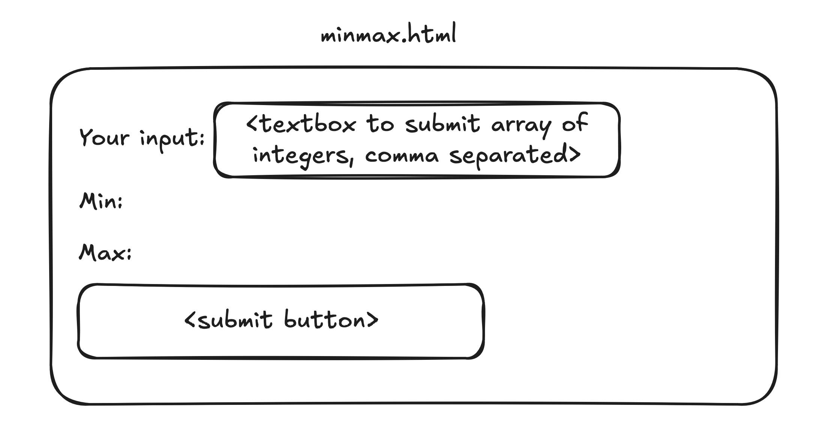
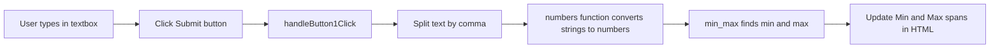
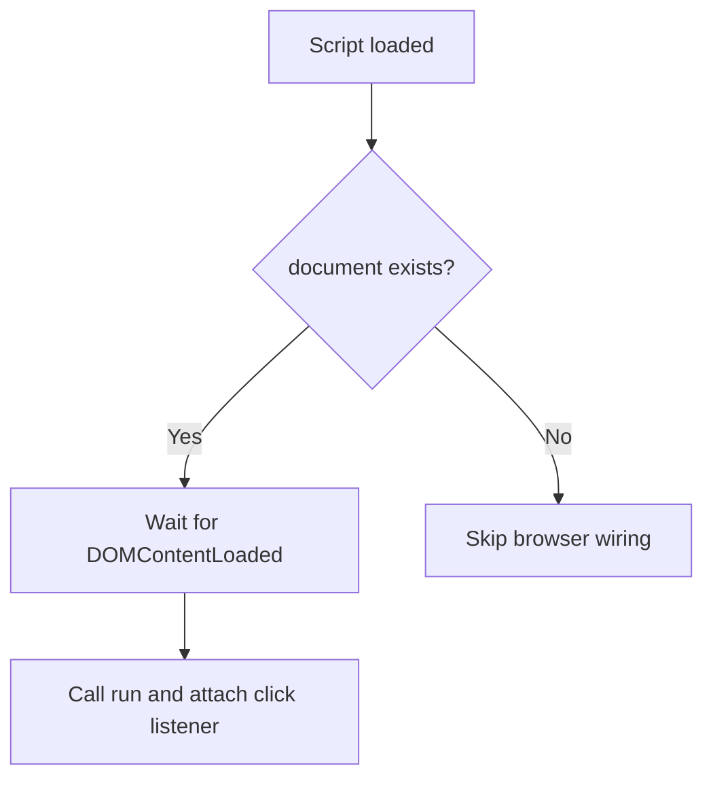

# Finding Min and Max from User Input (HTML + TypeScript)

This project is a small frontend app that lets a user type numbers into a text box, click **Submit**, and see:

1. the smallest number (min)
2. the largest number (max)

The goal is to show how HTML and TypeScript connect in a beginner-friendly way.

## What Problem Are We Solving?

When users type input in a browser, it comes in as text.
For example, if the user enters:

```text
10, 2, 35, 7
```

the app needs to:

1. split the text into pieces
2. convert each piece into a number
3. ignore invalid values
4. compute min and max
5. display results on the page

## Visual Preview



## How the Pieces Fit Together

### High-Level Flow



### File Structure

```text
.
├── minmax.html        # UI: textbox, output spans, button
├── src/minmax.ts      # App logic and browser event wiring
├── minmax.test.ts     # Unit tests for core functions
├── dist/minmax.js     # Compiled JS output from TypeScript
├── package.json       # Scripts and dev dependencies
└── tsconfig.json      # TypeScript compiler config
```

## Code Walkthrough

### 1) HTML: build the UI

In `minmax.html`, you define:

1. an input field (`textbox1`)
2. two spans to display output (`min`, `max`)
3. a submit button (`button1`)
4. a script tag that loads the compiled TypeScript output (`./dist/minmax.js`)

```html
<div>Your input: <input id="textbox1" type="text" /></div>
<div>Min: <span id="min"></span></div>
<div>Max: <span id="max"></span></div>
<div><button id="button1">Submit</button></div>
```

### 2) TypeScript function: `numbers(l: string[])`

Purpose: convert array of strings into array of valid integers.

Example:

```text
input:  ["1", " 2", "x"]
output: [1, 2]
```

It uses `parseInt(..., 10)` for base-10 conversion and skips values that become `NaN`.

### 3) TypeScript function: `min_max(a: number[])`

Purpose: return both min and max from a numeric array.

It uses:

- `Math.min(...a)`
- `Math.max(...a)`

and returns an object:

```ts
{ min: number, max: number }
```

### 4) TypeScript function: `handleButton1Click()`

This is the main event handler for the button.

Steps:

1. read text from `textbox1`
2. split text by commas into string array
3. call `numbers(...)`
4. call `min_max(...)`
5. write results into `min` and `max` spans

### 5) TypeScript function: `run()`

This connects the button click to your event handler:

```ts
button1.addEventListener("click", handleButton1Click)
```

### 6) DOM-ready safety check

The code only attaches browser listeners when `document` exists.
That helps avoid issues during testing environments.



## Getting Started

### Prerequisites

- Node.js (LTS recommended)
- npm (comes with Node.js)

### Install dependencies

```bash
npm install
```

### Compile TypeScript

```bash
npx tsc
```

This generates JavaScript in `dist/` based on `tsconfig.json`.

### Run the page

Option 1:

1. Open `minmax.html` in your browser.
2. Enter values like `10, 3, 99, -2`.
3. Click **Submit**.

Option 2 (recommended for local development):

1. Use a local web server (for example VS Code Live Server).
2. Open `minmax.html` through that server.

## Running Tests

Run all tests once:

```bash
npm test
```

Run tests in watch mode:

```bash
npm run test:watch
```

Current tests check:

1. `numbers` parses valid integers and skips invalid strings
2. `min_max` returns correct minimum and maximum

## Things to Know (Important Edge Cases)

1. If input is empty, min/max behavior is based on JavaScript math defaults.
2. `parseInt` reads integer prefixes, so values like `3.9` become `3`.
3. Extra spaces are fine (`" 2"` is parsed as `2`).

Possible improvement for next iteration:

1. show a user-friendly error for empty input
2. support decimal numbers with `parseFloat`
3. validate input before computing min/max

## Authors

[Roshan](https://github.com/redhoodtxt)

## References

- [npm docs](https://docs.npmjs.com/packages-and-modules)
- [TypeScript docs](https://www.typescriptlang.org/docs/)
- [MDN: `parseInt`](https://developer.mozilla.org/en-US/docs/Web/JavaScript/Reference/Global_Objects/parseInt)
- [MDN: DOMContentLoaded](https://developer.mozilla.org/en-US/docs/Web/API/Document/DOMContentLoaded_event)