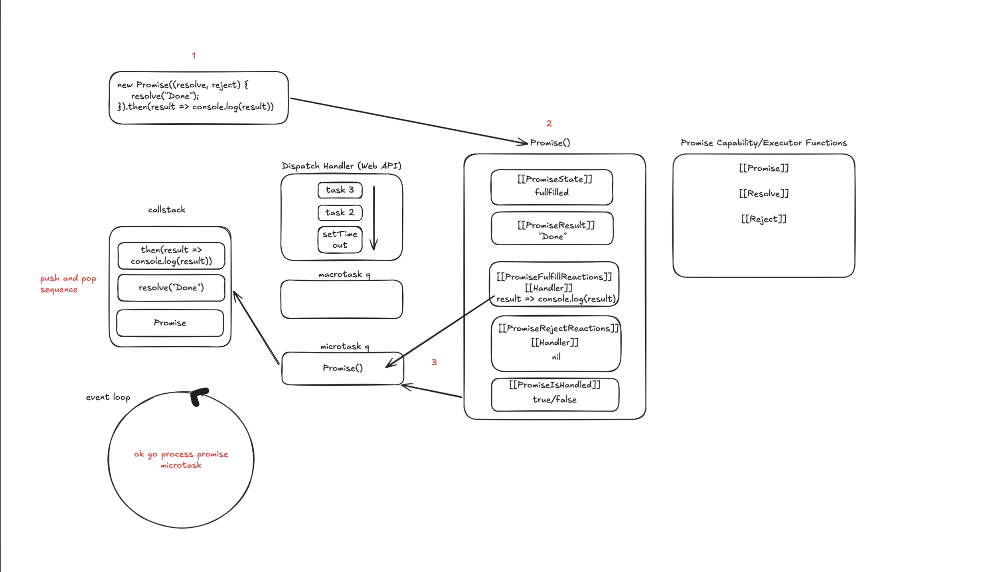
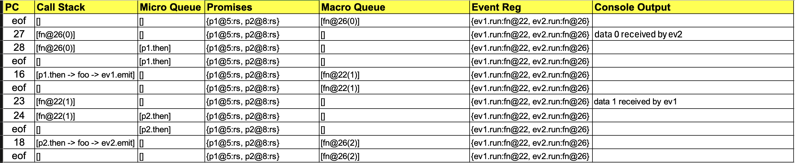

https://medium.com/@rajendransoundar3/javascript-execution-flow-call-stack-microtasks-and-macrotasks-a44eaa9f9054
https://www.javascripttutorial.net/javascript-event-loop/
https://en.wikipedia.org/wiki/Event_loop
https://medium.com/@javascriptvisualized/eventloop-visualized-javascript-model-d5b9d5a93a38
https://developer.mozilla.org/en-US/docs/Web/JavaScript/Reference/Global_Objects/Promise#thenables
https://developer.mozilla.org/en-US/docs/Web/JavaScript/Reference/Global_Objects/Promise/resolve

[Promises](https://www.youtube.com/watch?v=Xs1EMmBLpn4)

[Playground](https://developer.mozilla.org/en-US/play)

[Notes](https://sutdapac.sharepoint.com/:f:/s/50003ESC2026Summer/IgC3EzIA-EHMQbceheHSqQ29AWHRiIeeUBWMmNVO7LDgCdc?e=mNXcp9)



# Answer 
```js
1:  import EventEmitter from 'events';
2:  const ev1 = new EventEmitter();
3:  const ev2 = new EventEmitter();
4:  let count = 0;
5:  let promise1 = new Promise( (resolve, reject) => {
6:      resolve(count); // resolve(0)
7:  })
8:  let promise2 = new Promise( (resolve, reject) => {
9:      resolve(count); // resolve(0)
10: })
11: function foo(x) {
12:     return new Promise((resolve, reject) => {
13:         if (x > 10) {
14:             resolve();
15:         } else if (x % 2 == 0) {
16:             ev1.emit('run', ++x);
17:         } else {
18:             ev2.emit('run', ++x);
19:         }
20:     })
21: }
22: ev1.on('run', (data) => { setImmediate(() => {
23:     console.log(`data ${data} received by ev1`);
24:     promise2.then((x) => foo(data)); });
25: });
26: ev2.on('run', (data) => { setImmediate(() => {
27:     console.log(`data ${data} received by ev2`);
28:     promise1.then((x) => foo(data)); });
29: });
30:ev2.emit('run', count); // triggers the event handler to pass over to function 26 
```



The program hits an infinite loop bouncing back and forth through setImmediate, it leads to non-termination. It will continue incrementing count up until x > 10 is hit inside foo(x). When x reaches 11, line 14 executes (resolve()), which terminates generating new event emits.

