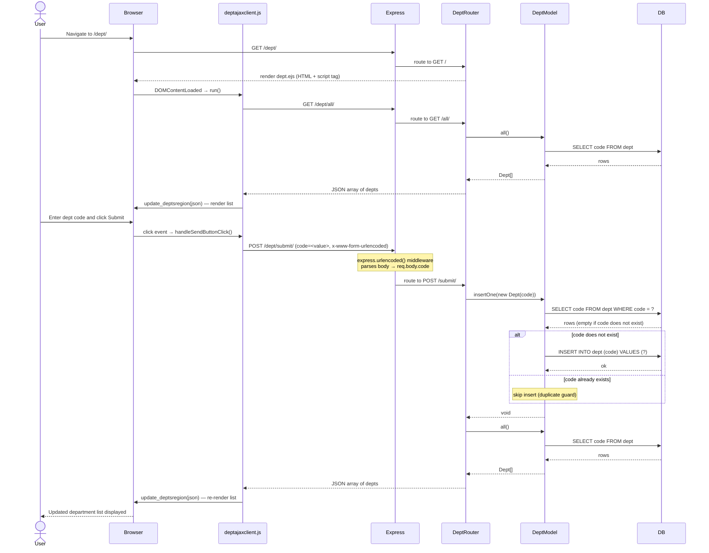

# Sequence Diagram: Create a Department Record

## Participants

| Participant | File |
|---|---|
| `deptajaxclient.js` | `public/javascripts/deptajaxclient.js` |
| `Express` | `app.ts` (middleware: `express.urlencoded`, morgan, cookie-parser) |
| `DeptRouter` | `routes/dept.ts` |
| `DeptModel` | `models/dept.ts` |
| `DB` | `models/db.ts` (mysql2 connection pool) |

## Notes

- The duplicate guard in `DeptModel.insertOne()` (`routes/dept.ts:79`) performs a `SELECT` before the `INSERT`. If a record with the same `code` already exists, the insert is silently skipped.
- After every successful call to `POST /dept/submit/`, the server returns the full updated dept list, which the client uses to re-render the page without a full reload.
