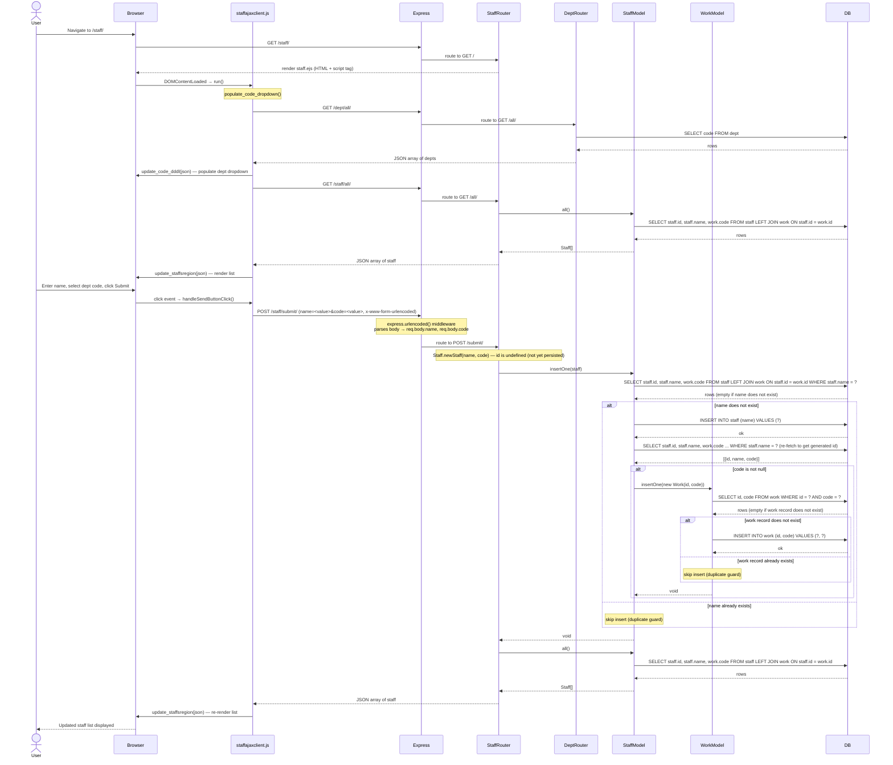

# Sequence Diagram: Create a Staff Record

## Participants

| Participant | File |
|---|---|
| `staffajaxclient.js` | `public/javascripts/staffajaxclient.js` |
| `Express` | `app.ts` (middleware: `express.urlencoded`, morgan, cookie-parser) |
| `StaffRouter` | `routes/staff.ts` |
| `DeptRouter` | `routes/dept.ts` |
| `StaffModel` | `models/staff.ts` |
| `WorkModel` | `models/work.ts` |
| `DB` | `models/db.ts` (mysql2 connection pool) |

## Notes

- On page load, the client fetches the dept list (`GET /dept/all/`) to populate the dropdown, and the staff list (`GET /staff/all/`) to pre-render the existing records.
- `Staff.newStaff(name, code)` (`models/staff.ts:17`) is a static factory that creates a `Staff` with `id = undefined`, indicating the record has not yet been persisted.
- `StaffModel.insertOne()` (`models/staff.ts:133`) performs a duplicate guard using `findOneByName()` before inserting. If the name already exists, the insert is silently skipped.
- After inserting the staff row, the model re-fetches the row by name to retrieve the database-generated `id` (`AUTO_INCREMENT`), which is required to create the `Work` junction record.
- The `Work` record (`models/work.ts:81`) links the staff `id` to the dept `code` and is only created if a dept code was selected. It also has its own duplicate guard.
- After every successful `POST /staff/submit/`, the server returns the full updated staff list, which the client uses to re-render the page without a full reload.
