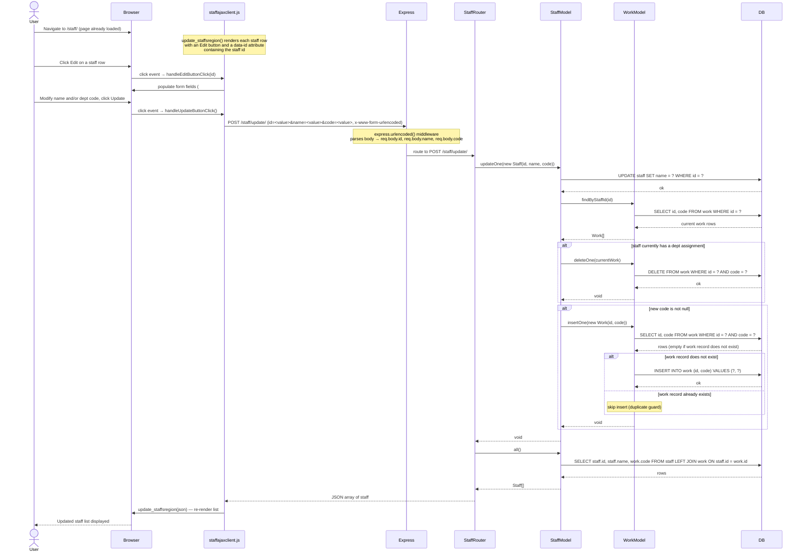

# Sequence Diagram: Update a Staff Record (Design Proposal)

This is a design proposal. No implementation exists yet for this flow.

The design follows the conventions established by the existing create-staff flow:
- AJAX via `XMLHttpRequest` with `application/x-www-form-urlencoded` bodies
- Route returns the full refreshed staff list as JSON; client re-renders in place
- Model layer handles both the `staff` table and the `work` junction table

> **Note on data model:** A staff member's dept assignment (`code`) is not stored on the `staff` table. It is stored in the `work` junction table (`work.id` → `staff.id`, `work.code` → `dept.code`). Updating a staff record therefore requires changes to both tables.

---

---

## Participants

| Participant | File (proposed) |
|---|---|
| `staffajaxclient.js` | `public/javascripts/staffajaxclient.js` |
| `Express` | `app.ts` (existing middleware: `express.urlencoded`, morgan) |
| `StaffRouter` | `routes/staff.ts` — add `POST /staff/update/` |
| `StaffModel` | `models/staff.ts` — add `updateOne(staff: Staff)` |
| `WorkModel` | `models/work.ts` — reuse existing `findByStaffId`, `deleteOne`, `insertOne` |
| `DB` | `models/db.ts` (existing mysql2 connection pool) |

---

## Changes Required

### `models/staff.ts`
- Add `updateOne(staff: Staff): Promise<void>`:
  - `UPDATE staff SET name = ? WHERE id = ?`
  - Call `workModel.findByStaffId(id)` to retrieve the current dept assignment
  - Call `workModel.deleteOne(currentWork)` for each existing work row
  - If `staff.code` is not null, call `workModel.insertOne(new Work(id, code))`

### `routes/staff.ts`
- Add `POST /staff/update/` handler:
  - Read `id`, `name`, `code` from `req.body`
  - Call `staffModel.updateOne(new Staff(id, name, code))`
  - Call `staffModel.all()` and return `JSON.stringify(staffs)` — same shape as `/submit/`

### `public/javascripts/staffajaxclient.js`
- Update `update_staffsregion(json)` to embed `staff.id` on each rendered row (e.g. `data-id` attribute) and render an Edit button per row
- Add `handleEditButtonClick(id)` to populate the form fields with the selected staff's current values
- Add `handleUpdateButtonClick()` to POST `id`, `name`, `code` to `/staff/update/` and call `update_staffsregion` on the response

### `views/staff.ejs`
- Add a hidden `<input id="id" type="hidden"/>` to carry the staff `id` when the form is used for updates
- Add an Update button (e.g. `<input id="updateButton" type="submit"/>`) distinct from the existing Create button

---

## Notes

- The staff `id` is never displayed in the current UI. The update flow requires the client to track `id` so it can be included in the update request. The simplest approach is a `data-id` attribute on each `<li>` and a hidden form field.
- `workModel.deleteOne` and `workModel.insertOne` already exist in `models/work.ts` and require no changes.
- No new SQL migrations are needed — the schema already supports this flow.
