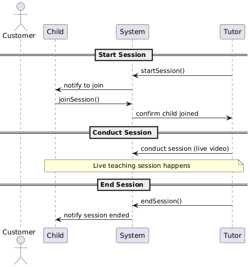

# Cohort Exercise - Use Case

## Learning Outcomes

By the end of this exercise, you should be able to

1. Analyse system structure using domain class diagrams 

## Total 20 Marks

## Task 1 (15 Marks)

Consider the below requirements given to you in Cohort Exercise 4. 

A customer signs up an account in the online tuition system. During the sign-up, the customer needs
to supply the following particulars 

1. the customer's email, preferred password and mobile number.
1. the customer's child/ward's such as age and current education level.
1. the tuition subject. 

Upon successful sign-up, the system sends a confirmation email to the customer.

After login, the customer browses through the list of tutor profiles. The customer selects a tutor
she prefers to view the tutor's available time slots. Upon selecting a slot, the customer needs to pay 
for the session that she books using a credit card. The system verifies the credit card payment. 
Upon successful payment, the system sends an email confirmation to the customer for her booking. 
The system sends an email and SMS notification to the tutor regarding the booking. 
When the payment is unsuccessful, the system prompts the customer to use a different payment method. 
The customer can logout from the system anytime she wants.   

An hour before the booked online tuition session, the system sends an SMS reminder to the customer and the tutor about the upcoming session. The tutor starts the teaching session based on the booked time slot. The customer's child/ward joins the session using customer's account. When the session ends, the tutor assigns homework to the child/ward. The child/award attempts the homework and submits the answer to the tutor through the system. The tutor grades the child/ward's homework and gives a grade and a comment. 

1. Identify at least six domain classes and their attributes in the above scenario.

1. Identify at least one inheritance, dependancy, association, aggregation and composition and justify your choices

1. For the above identified relationships, provide the multiplicities and justify

1. Summarize the above in a UML domain class diagram

## Task 2 (5 Marks)

Given below is a part of the sequence diagram for attending a session. Identify the  chronological order of steps in the format classA calls method m() in classB.

{ width=600px height=500px } 

